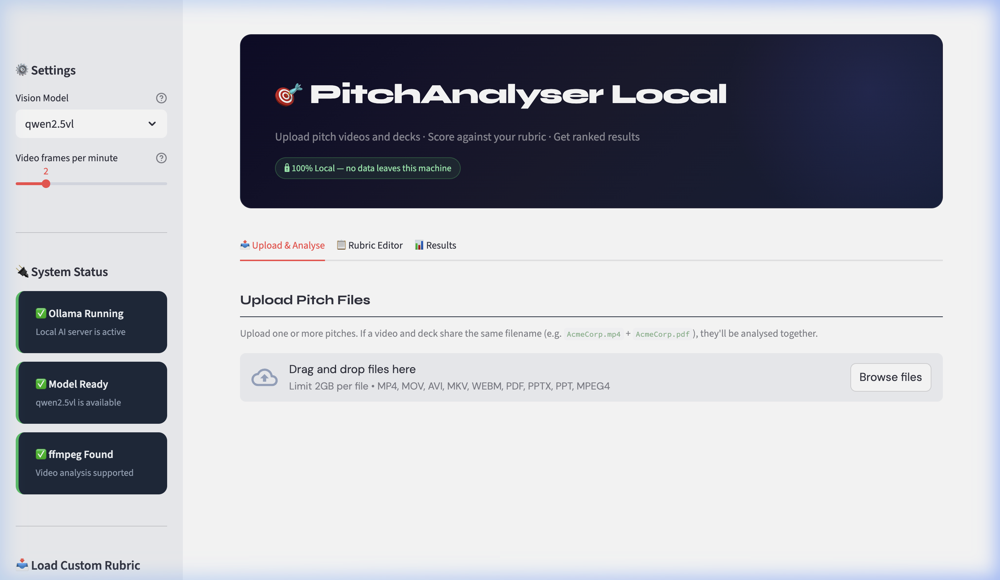
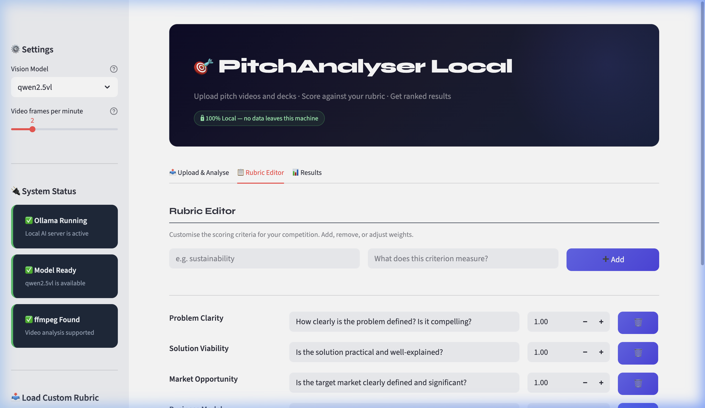
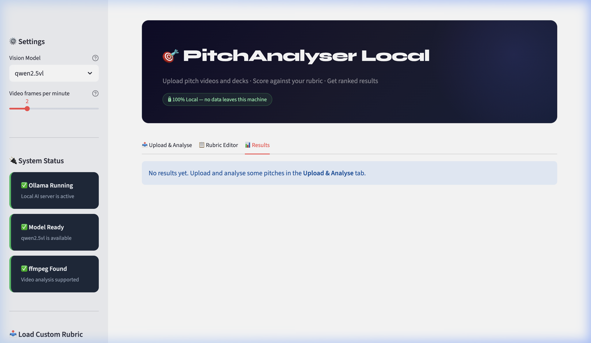

# 🎯 PitchAnalyser Local

**Analyse and rank startup pitch videos and decks — entirely on your own machine.**

Upload pitch videos (`.mp4`, `.mov`) and/or slide decks (`.pdf`, `.pptx`) and get a ranked leaderboard with detailed scores and written justifications, all powered by a local AI model. **Nothing ever leaves your computer.**

---

## ✨ Features

- 🎬 Analyse pitch **videos** and/or **slide decks** (or both together)
- 🏆 Automatic **ranked leaderboard** with weighted scores out of 10
- 📋 Fully **customisable rubric** — adjust criteria and weights to your needs
- 📄 Download a **standalone HTML report** or raw **JSON data**
- 🔒 **100% private** — all AI inference runs locally via [Ollama](https://ollama.com)
- 🖥️ Simple **web interface** — no command line needed (but CLI is also available)

---

## 📸 Screenshots

**Upload & Analyse** — drag-and-drop pitch files and run the AI analysis


**Rubric Editor** — customise scoring criteria and weights for your event


**Results** — ranked leaderboard with detailed per-pitch breakdowns


---

## 📋 What you'll need (one-time install)

| Requirement | What it's for | Download |
|---|---|---|
| **Python 3.10+** | Runs the application | [python.org](https://www.python.org/downloads/) |
| **Ollama** | Runs the local AI model | [ollama.com](https://ollama.com) |
| **ffmpeg** _(optional)_ | Needed for video analysis | See below |
| **LibreOffice** _(optional)_ | Better `.pptx` rendering | [libreoffice.org](https://www.libreoffice.org/download/) |

### Install ffmpeg

```bash
# macOS (requires Homebrew — https://brew.sh)
brew install ffmpeg

# Windows (easiest)
winget install ffmpeg

# Ubuntu/Debian
sudo apt install ffmpeg
```

### Download the AI model

After installing Ollama, open a terminal and run:

```bash
ollama pull qwen2.5vl
```

This downloads the AI model (~5 GB). You only need to do this once.

---

## 🚀 Quick Start

The setup scripts create a **self-contained Python environment** (`.venv` folder) so nothing is installed globally on your machine.

### Windows

1. Double-click **`SETUP.bat`** (first time only)
2. Double-click **`START.bat`** to launch the app

### macOS / Linux

```bash
# First time only
chmod +x setup.sh start.sh
./setup.sh

# Every time you want to use it
./start.sh
```

A browser window will open at `http://localhost:8501` automatically.

> **Advanced users:** If you prefer to manage the environment yourself, activate it with `source .venv/bin/activate` (macOS/Linux) or `.venv\Scripts\activate` (Windows), then run `streamlit run app.py`.

---

## 🖥️ Using the App

### 1. Check the status panel (left sidebar)
Make sure you see green ticks for:
- ✅ **Ollama Running**
- ✅ **Model Ready**
- ✅ **ffmpeg Found** _(only required for video analysis)_

### 2. Upload your pitches
Go to the **Upload & Analyse** tab and drag-and-drop your files. Videos and decks with the **same filename** (e.g. `AcmeCorp.mp4` + `AcmeCorp.pdf`) are automatically grouped as one pitch.

**Supported formats:** `.mp4` `.mov` `.avi` `.mkv` `.webm` `.pdf` `.pptx` `.ppt`

### 3. Analyse
Click **"Analyse All Pitches"** and wait. Analysis takes a few minutes per pitch.

### 4. View results
Switch to the **Results** tab to see:
- Ranked leaderboard with scores and recommendations
- Detailed breakdown per pitch (overall summary, key strengths, key concerns, per-criterion scores)
- Download buttons for the HTML report and JSON data

### 5. Customise the rubric (optional)
Use the **Rubric Editor** tab to add, remove, or re-weight criteria. Save your rubric as JSON to reuse next time.

---

## 💻 Command-line usage

For batch processing or scripting, you can also run the analyser from the terminal:

```bash
# Basic — analyse all pitches in a folder
python analyse.py ./pitches

# With a custom rubric
python analyse.py ./pitches --rubric rubric_example.json

# Use a different model
python analyse.py ./pitches --model llava:7b

# Control how many video frames are sampled per minute (default: 2)
python analyse.py ./pitches --frames-per-minute 3

# Save results to a specific folder
python analyse.py ./pitches --output-dir ./results/round1
```

---

## 🗂️ Project structure

```
├── app.py                    # Streamlit web UI (main entry point)
├── analyse.py                # Command-line interface
├── pitchanalyser/            # Core Python package
│   ├── __init__.py
│   ├── extractor.py          # Extracts frames from videos and pages from decks
│   ├── scorer.py             # Sends images to the local Ollama model for scoring
│   └── reporter.py           # Generates ranked HTML and JSON reports
├── rubric_example.json       # Example rubric — copy and customise for your event
├── requirements.txt          # Python dependencies
├── setup.sh / SETUP.bat      # First-time setup scripts (create .venv)
└── start.sh / START.bat      # Launch scripts
```

---

## 🛠️ Custom rubric

Edit `rubric_example.json` or create your own rubric file:

```json
{
  "innovation": {
    "description": "How novel and original is the idea?",
    "weight": 2.0
  },
  "feasibility": {
    "description": "Is the solution technically and commercially feasible?",
    "weight": 1.5
  },
  "team": {
    "description": "Does the team have the skills to execute?",
    "weight": 2.0
  }
}
```

- **`description`**: Shown to the AI as scoring guidance
- **`weight`**: Relative importance in the final score (higher = more important)

Load your rubric via the sidebar in the web UI or pass it with `--rubric` on the command line.

---

## 💾 Outputs

| File | Description |
|---|---|
| `report.html` | Standalone interactive report with radar chart and score breakdowns |
| `results.json` | Full machine-readable results with all scores and justifications |

Open `report.html` directly in any browser — no server needed.

---

## 🖥️ Hardware requirements

| Model | VRAM | Notes |
|---|---|---|
| `qwen2.5vl` (default, 7B Q4) | ~6 GB | Best quality/speed balance |
| `llava:7b` | ~6 GB | Faster, slightly lower quality |
| `llama3.2-vision:11b` | ~8 GB | Good alternative |
| `qwen2.5vl:72b` (Q4) | ~40 GB | Maximum quality |

No GPU? Models will run on CPU — slower but functional. A 10-minute video typically takes 5–10 minutes on CPU.

---

## 🔒 Privacy

- **Zero network calls** during analysis — all inference runs locally via Ollama
- The Ollama API is only accessible on `localhost:11434` by default
- Extracted frames and pages are written to a temporary directory and cleaned up after scoring

---

## 🐛 Troubleshooting

| Problem | Solution |
|---|---|
| "Ollama not running" | Open the Ollama app or run `ollama serve` in a terminal |
| "Model not pulled" | Run `ollama pull qwen2.5vl` in a terminal |
| "ffmpeg not found" | Install ffmpeg (see setup above) |
| "Browser doesn't open" | Manually visit `http://localhost:8501` |
| Videos not processing | Install ffmpeg |
| PPTX slides look wrong | Install LibreOffice for best rendering |
| Slow scoring | Use a smaller model (`llava:7b`) or reduce frames per minute |
| App won't start | Re-run `SETUP.bat` / `setup.sh` |

---

## 📄 Licence

[MIT](LICENSE) © LumenEdge Consulting Ltd
